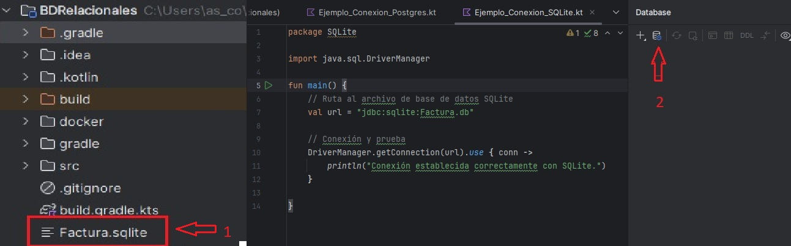
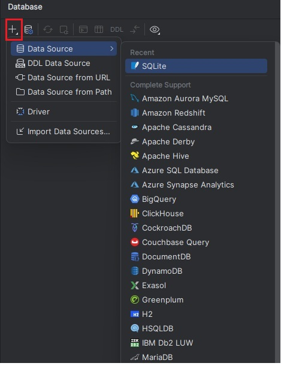
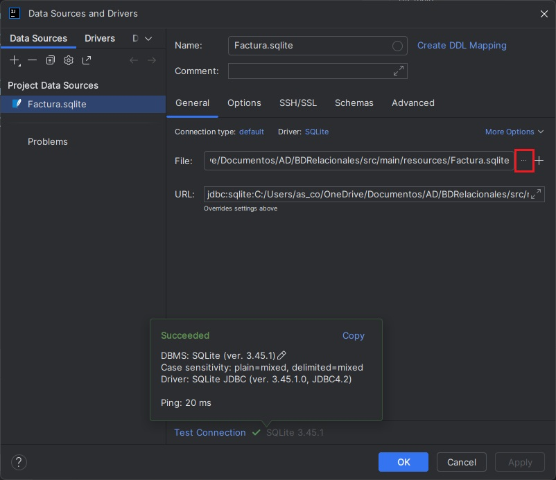
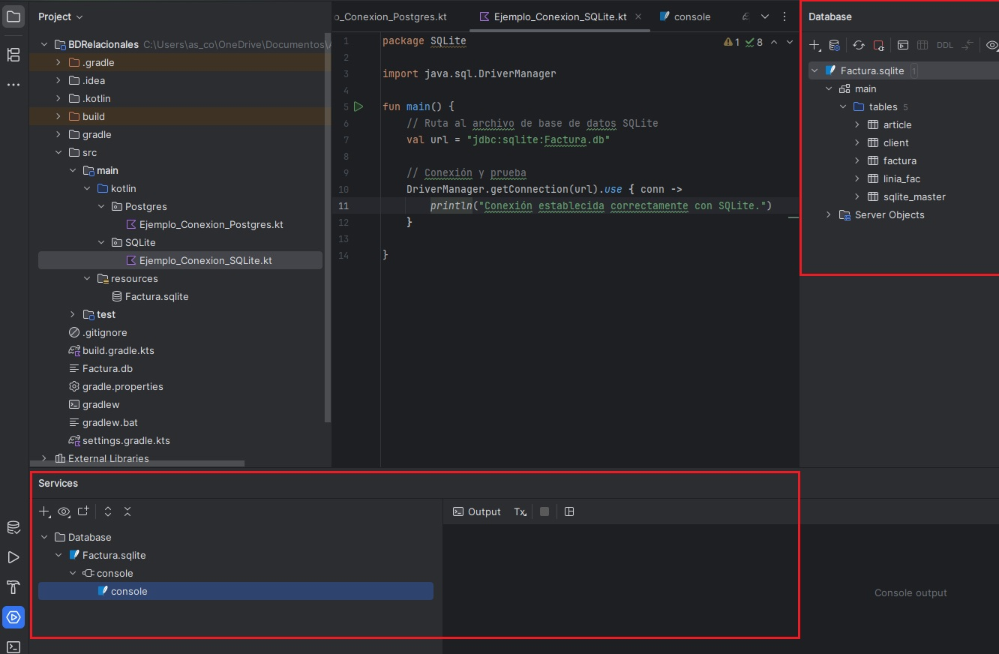

# Conectores

En la introducción ya vimos que un **conector** es una librería software que permite que una aplicación se comunique con un gestor de base de datos (SGBD). Actúa como un puente entre nuestro código y la base de datos, traduciendo las instrucciones SQL a un lenguaje que el gestor puede entender y viceversa.

**JDBC** (Java Database Connectivity) es la API básica de Java para conectarse a bases de datos relacionales.

Para que una aplicación (escrita en Kotlin, Java u otro lenguaje) pueda leer, insertar o modificar información almacenada en una base de datos relacional (BDR), debe establecer una conexión con ella. Esto implica una serie de **pasos técnicos** y el uso de componentes específicos:

- Conectarse al gestor de base de datos (PostgreSQL, MySQL, SQLite…)
- Enviar consultas SQL (SELECT, INSERT, UPDATE, DELETE…)
- Recibir y procesar resultados (ResultSet, listas de objetos…)
- Cerrar correctamente los recursos utilizados

**Requisitos para conectarse al SGBD**{.azul}

Elemento|	Función principal|
--------|--------------------|
Conector (Driver)|	Permite a la aplicación hablar con el SGBD
URL de conexión|	Indica el tipo de base de datos, la dirección, el puerto y el nombre de la BD
Usuario y contraseña|	Identifican al cliente y controlan el acceso

    jdbc:<gestor>://<host>:<puerto>/<nombre_base_datos>

### Ejemplos de conexión a un SGBD

Gestor de Base de Datos|	URL de conexión
-----------------------|---------------------
PostgreSQL|	jdbc:postgresql://localhost:5432/empresa
MySQL|	jdbc:mysql://localhost:3306/empresa
SQLite|	jdbc:sqlite:empresa.db

Para que la conexión funcione, es necesario **añadir el conector** correspondiente al SGBD:   

- **En un proyecto Gradle**

        dependencies {
            implementation("org.postgresql:postgresql:42.7.1") //Postgres
            implementation("mysql:mysql-connector-java:8.3.0") //MySQL
            implementation("org.xerial:sqlite-jdbc:3.43.0.0") //SQLite
        }

<!--
- **En un proyecto Maven**

        <dependency>
            //Postgres
            <groupId>org.postgresql</groupId>
            <artifactId>postgresql</artifactId>
            <version>42.7.1</version>
        </dependency>

        <dependency>
            //MySQL
            <groupId>mysql</groupId>
            <artifactId>mysql-connector-java</artifactId>
            <version>8.3.0</version>
        </dependency>

        <dependency>
            //SQLite
            <groupId>org.xerial</groupId>
            <artifactId>sqlite-jdbc</artifactId>
            <version>3.43.0.0</version>
        </dependency>

-->

**Ejemplo de conexión a Postgresql**

        import java.sql.DriverManager

        
        fun main() {
            // Ruta al archivo de base de datos Postgres
            val url = "jdbc:postgresql://localhost:5432/empresa"
            val user = "postgres"
            val pass = "admin"

            // Conexión y prueba
            DriverManager.getConnection(url, user, pass).use { conn ->
                println("Conexión establecida correctamente.")
            }        
        }

**Ejemplo de conexión a SQLite**

        import java.sql.DriverManager

        fun main() {
            // Ruta al archivo de base de datos SQLite
            val url = "jdbc:sqlite:Factura.db"

            // Conexión y prueba
            DriverManager.getConnection(url).use { conn ->
                println("Conexión establecida correctamente con SQLite.")
            }
        }

!!!Note "Recuerda"
    No se necesita usuario ni contraseña con SQLite, ya que es una base de datos local y embebida.      

**Ventajas e inconvenientes de los conectores**{.azul}

Ventajas|	Inconvenientes
--------|-----------------
Estándar y multiplataforma|	Requiere configurar dependencias
Permite acceso a múltiples SGBD| Gestión manual de errores y recursos
Uso directo de SQL|	Código más extenso en comparación con ORM

## Acceso a la BD desde IntellJ

En el desarrollo de aplicaciones, especialmente aquellas que utilizan bases de datos relacionales como PostgreSQL, MySQL o SQLite, es fundamental tener una visión clara y rápida del estado de los datos. Poder visualizar la base de datos directamente desde el entorno de desarrollo (IDE) ofrece una ventaja significativa frente a trabajar con herramientas externas.

IntelliJ IDEA incorpora una potente herramienta de gestión de bases de datos que permite:

- 📂 Explorar la estructura de la base de datos (tablas, vistas, claves, relaciones…)
- 🔎 Consultar datos en tiempo real con editores SQL integrados
- 🛠️ Modificar tablas, añadir registros o ejecutar scripts SQL sin salir del proyecto
- ⚡ Ver los cambios reflejados inmediatamente tras ejecutar una operación desde el código
- ✅ Probar consultas antes de implementarlas en el programa

La siguientes imágenes ilustran como configura esta herramienta:

- 1- Copiamos el archivo con la base de datos en el proyecto (carpeta resources).

- 2- Seleccionamos la opción **Database**.

- 3- Seleccionamos el **+**, y elegimos en **Data Source** la base de datos que corresponda. En el ejemplo trabajaremos con SQLite.

- 4- Seleccionamos **...** y buscamos el archivo de nuestra basededatos.db.  
Podemos comprobar la conexión en **Test Concection**{.verde} antes de aceptar.  
Al aceptar, se nos pedirá que instalemos **el driver** correspondiente, si no estuviera instalado.

- 5- Una vez configurado el acceso a la BD podemos ver en diferentes ventanas la estructura de la BD y el resultado de ejecutar las sentencias SQL.

