# Herramientas y Conectores

De todas las formas posibles de interactuar con una base de datos, nos vamos a centrar en el uso de **conectores**, porque son la forma más directa y habitual de acceder a la base de datos desde un lenguaje de programación, como Kotlin, que es el que estamos utilizando en este módulo.

En la introducción ya vimos que un **conector** (también llamado driver) es una librería software que permite que una aplicación se comunique con un gestor de base de datos (SGBD). Actúa como un puente entre nuestro código y la base de datos, traduciendo las instrucciones SQL a un lenguaje que el gestor puede entender y viceversa. Sin un conector, tu aplicación no podría comunicarse con la base de datos.

- En herramientas gráficas como **DBeaver**, los drivers se gestionan automáticamente.
- En **proyectos en código**, se añaden como dependencia (por ejemplo, en Maven, Gradle, pip…).

Una base de datos puede ser accedida desde diferentes orígenes o herramientas, siempre que tengamos:

- Las credenciales de acceso (usuario y contraseña)
- El host/servidor donde se encuentra la base de datos
- El motor de base de datos (PostgreSQL, MySQL, SQLite, etc.)
- Los puertos habilitados y los permisos correctos

**Principales formas de conectarse a una base de datos**{.azul}

| Medio de conexión                         | Descripción                                                                 |
|-------------------------------------------|-----------------------------------------------------------------------------|
| 🖥️ Aplicaciones de escritorio             | Herramientas gráficas como **DBeaver**, **pgAdmin**, **MySQL Workbench**, **DB Browser for SQLite**. Permiten explorar, consultar y administrar BD de forma visual. |
| 💻 Aplicaciones desarrolladas en código   | Programas en **Kotlin**, **Java**, **Python**, **C#**, etc., mediante **conectores**{.verde} como **JDBC**, **psycopg2**, **ODBC**, etc. para acceder a BD desde código. |
| 🔠 Línea de comandos                      | Clientes como `psql` (PostgreSQL), `mysql`, `sqlite3`. Permiten ejecutar comandos SQL directamente desde terminal. |
| 🌐 Aplicaciones web                        | Sitios web que acceden a BD desde el backend (por ejemplo, en Spring Boot, Node.js, Django, etc.). |
| 🔄 APIs REST o servidores intermedios     | Servicios web que conectan la BD con otras aplicaciones, actuando como puente o capa de seguridad. |
| 📱 Aplicaciones móviles                   | Apps Android/iOS que acceden a BD locales (como **SQLite**) o remotas (vía **Firebase**, API REST, etc.). |
| 📂 Herramientas de integración de datos   | Software como **Talend**, **Pentaho**, **Apache Nifi** para migrar, transformar o sincronizar datos entre sistemas. |

## 🔹JDBC 

JDBC (Java Database Connectivity) es una API estándar de Java que permite a los programas escritos en Java (y por extensión en Kotlin) conectarse y trabajar con bases de datos relacionales.

- **Driver JDBC**: cada gestor de BD proporciona un "driver" específico (un .jar) que implementa la interfaz de JDBC.

    `mysql-connector-j, postgresql-42.x.jar, sqlite-jdbc.jar.`

- **URL de conexión**: se usa una cadena con formato `jdbc:<gestor>://<host>:<puerto>/<nombre_base_datos>` para indicar cómo llegar a la BD.

    Gestor de Base de Datos|	URL de conexión
    -----------------------|---------------------
    PostgreSQL|	jdbc:postgresql://localhost:5432/empresa
    MySQL|	jdbc:mysql://localhost:3306/empresa
    SQLite|	jdbc:sqlite:empresa.sqlite    

- **Código estándar**: gracias a JDBC, el mismo código Java/Kotlin puede trabajar con distintas bases de datos cambiando solo la URL y el driver.

   
!!!Tip ""
    En los siguientes apartados veremos como conectarnos a una BD Relacional, tanto desde la herramienta gráfica de BD integrada de **IntelliJ**  como desde la herramienta universal para la gestión de bases de datos **DBeaver** y también desde una aplicación desarrollada en **Kotlin**.

## 🔹Desde IntellJ

**IntelliJ** incorpora una potente herramienta de gestión de bases de datos que permite visualizar la base de datos directamente desde el entorno de desarrollo (IDE), lo que permite:

- 📂 Explorar la estructura de la base de datos (tablas, vistas, claves, relaciones…)
- 🔎 Consultar datos en tiempo real con editores SQL integrados
- 🛠️ Modificar tablas, añadir registros o ejecutar scripts SQL sin salir del proyecto
- ⚡ Ver los cambios reflejados inmediatamente tras ejecutar una operación desde el código
- ✅ Probar consultas antes de implementarlas en el programa

La siguientes imágenes ilustran como configura esta herramienta para conectarnos a la BD de ejemplo **Tienda.sqlite**, disponible en Aules:

**1. Crea un nuevo proyecto en Kotlin y Gradle**{.azul}

Al nuevo proyecto lo llamaremos **BDRelacionales**.

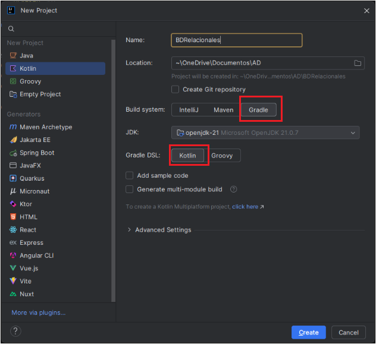

**2. Copia el archivo de la BD a nuestro proyecto**{.azul}

La ubicaremos en la carpeta **resources**. Esta carpeta forma parte del **classpath** del proyecto. Allí se colocan archivos que necesita la aplicación en tiempo de ejecución. Cuando compilas el **proyecto**, todo lo que está en **resources/** se copia dentro del jar o build **final** en la carpeta **classes**, manteniendo la misma estructura. Además, Si compartes el proyecto, la base de datos viaja con él.

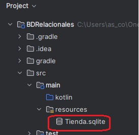

**3. Elige el conector a la base de datos**{.azul}

En la herramienta **Database -> Data Source** elegimos el conector **SQLite**. 

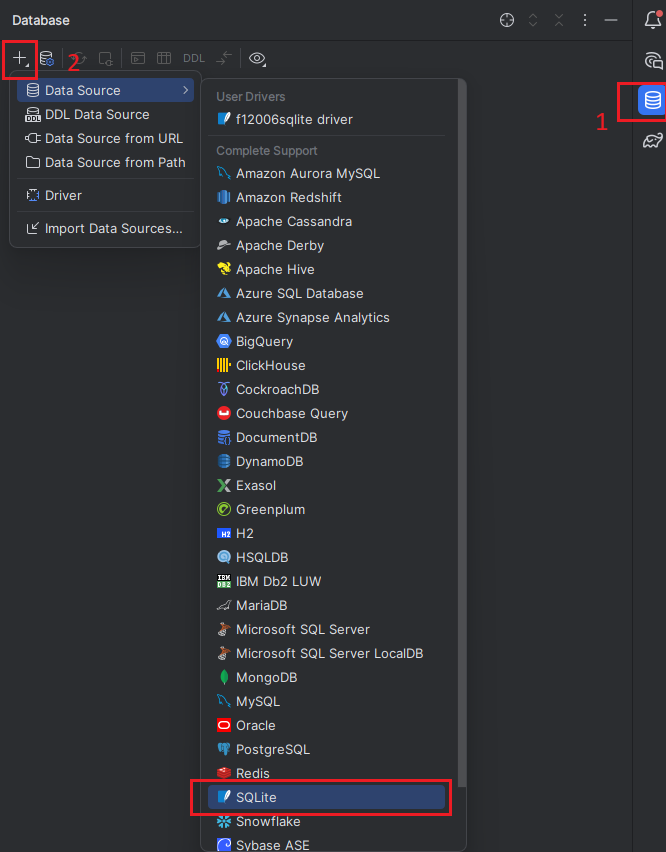

**4. Selecciona la ubicación de la BD**{.azul}

Podemos comprobar la conexión en **Test Concection** antes de aceptar.  
Al aceptar, se nos pedirá que instalemos **el driver** correspondiente, si no estuviera instalado.

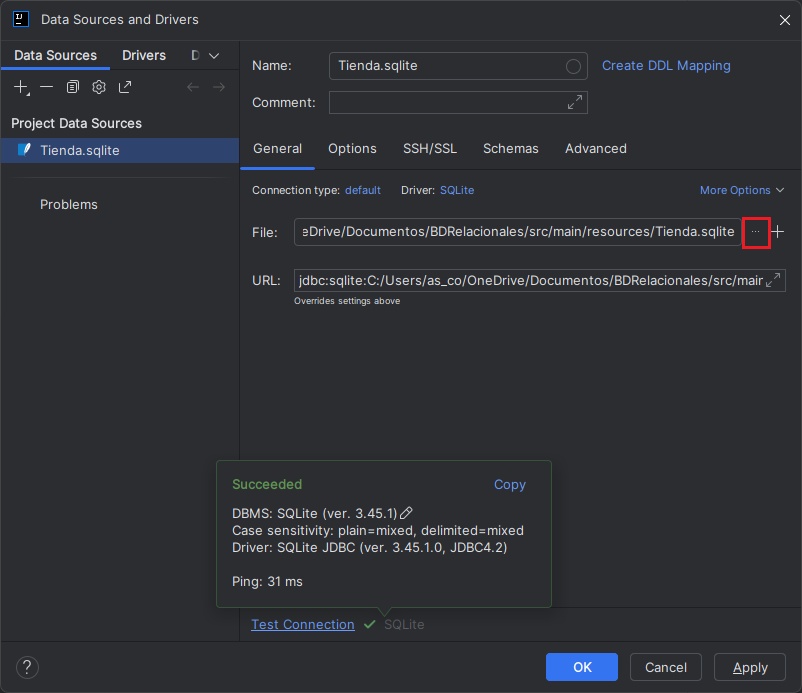

**5. Comprueba consultas antes de implementarlas**{.azul}

 Una vez configurado el acceso a la BD podemos ver en diferentes ventanas la estructura de la BD y el resultado de ejecutar las sentencias SQL, haciendo click derecho sobre la conexión y seleccionando la opción **New > QueryConsole**.

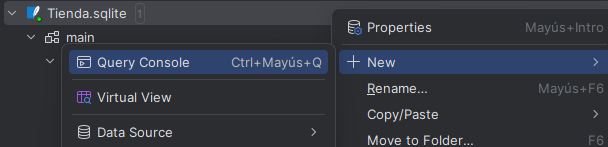

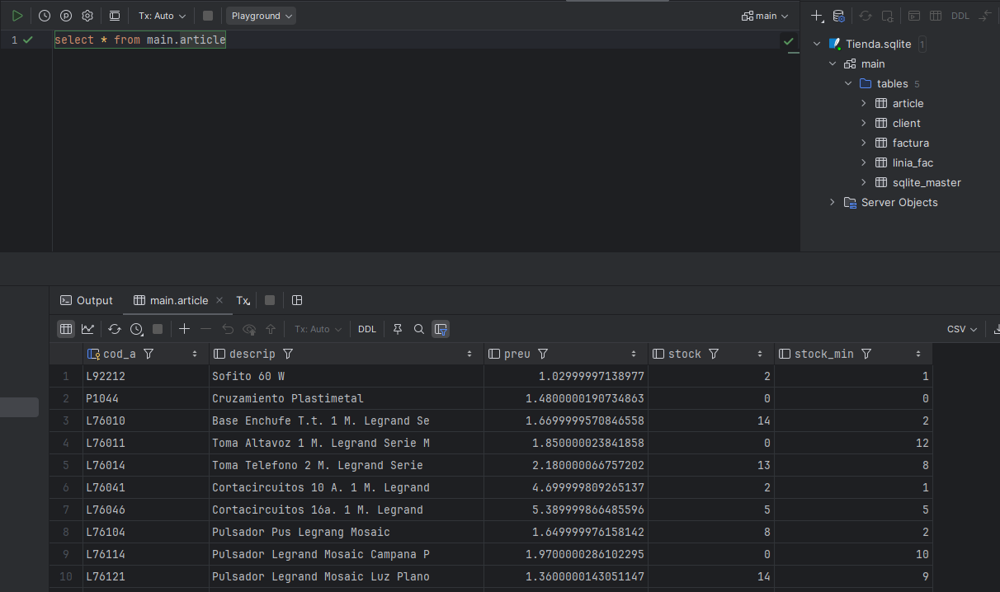

## 🔹Desde DBeaver    

**DBeaver** es una herramienta gráfica y gratuita que permite gestionar múltiples bases de datos de forma visual. Los pasos para conectarse a la BD  **Tienda.sqlite**, disponible en Aules, son los siguientes:

**1. Abre DBeaver**{.azul}

Inicia el programa **DBeaver**. Aparecerá la ventana principal con el panel lateral de conexiones.

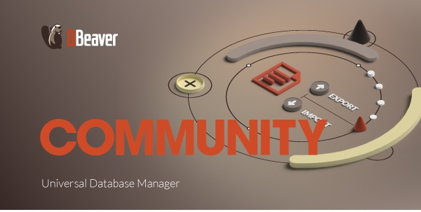

Haz clic en el botón **"Nueva conexión"** (ícono de enchufe) o ve al menú **Archivo > Nueva conexión**.

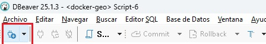

---

**2. Selecciona el tipo de base de datos**{.azul}

En la ventana de selección, elige **SQlite** y pulsa **Siguiente**.

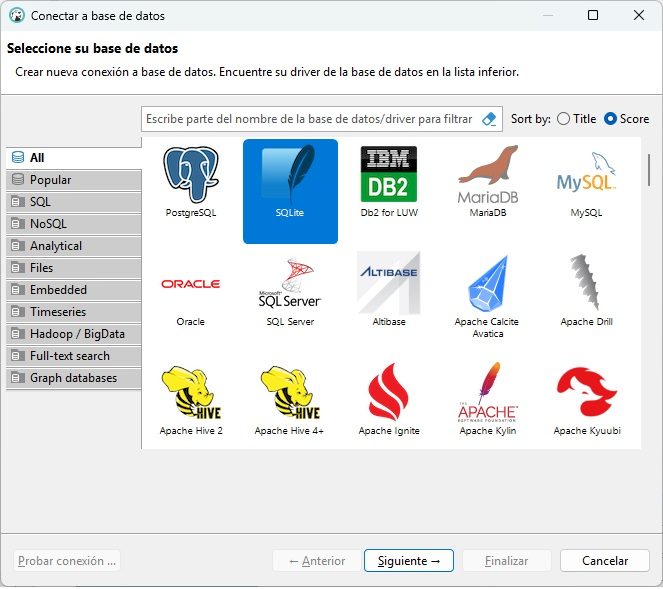

---

**3. Introduce la ruta donde se encuentra la BD**{.azul}

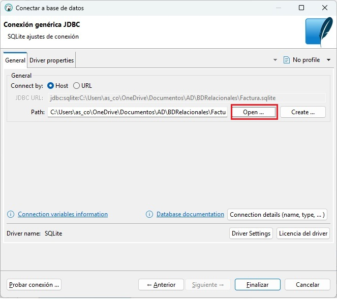

---

**4. Prueba la conexión**{.azul}

Haz clic en **"Probar conexión"**. Si todo está correcto, verás un mensaje de éxito.  
Si DBeaver necesita un controlador (driver), te lo ofrecerá para descargar automáticamente.

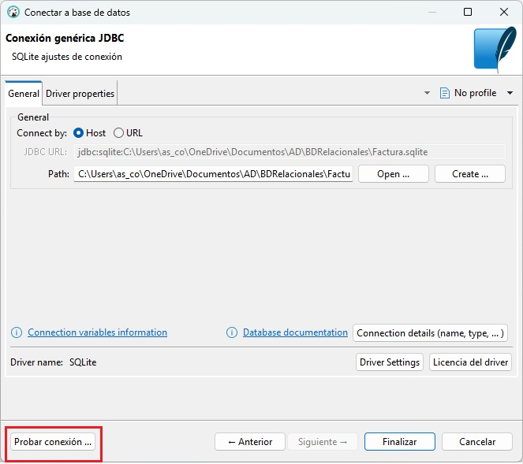

---

**5. Finaliza y explora**{.azul}

Haz clic en **"Finalizar"**. La nueva conexión aparecerá en el panel lateral izquierdo.  
Desde allí puedes:

- Ver tablas, vistas, funciones y procedimientos
- Ejecutar sentencias SQL
- Consultar y modificar registros
- Exportar datos en distintos formatos

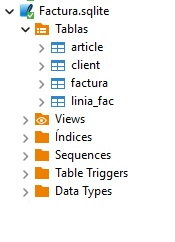

## 🔹Desde Kotlin

Para que una aplicación (escrita en Kotlin, Java u otro lenguaje) pueda leer, insertar o modificar información almacenada en una base de datos relacional (BDR), debe establecer una conexión con ella. Esto implica una serie de **pasos técnicos** y el uso de componentes específicos:

- Conectarse al gestor de base de datos (PostgreSQL, MySQL, SQLite…)
- Enviar consultas SQL (SELECT, INSERT, UPDATE, DELETE…)
- Recibir y procesar resultados (ResultSet, listas de objetos…)
- Cerrar correctamente los recursos utilizados

!!!Tip "Kotlin - Instrucciones"
    En el proyecto `BDRelacionales`, ya creado y conectado a la BD Tienda.sqlite, crearemos un **paquete** nuevo llamado `SQLite`. En este paquete incluiremos los ejemplos de este apartado. 

    

Para que la conexión funcione, es necesario **añadir el conector jdbc** correspondiente. Para ello utilizaremos la herramienta **Gradle**, que permite automatizar la gestión de dependencias sin tener que configurar nada a mano.

- **build.gradle.kts** : 

        dependencies {
            implementation("org.postgresql:postgresql:42.7.1") //Postgres
            implementation("mysql:mysql-connector-java:8.3.0") //MySQL
            implementation("org.xerial:sqlite-jdbc:3.43.0.0") //SQLite
        }

**Ejemplo de conexión a SQLite**{.azul}

**Ejemplo_Conexion_SQLite.kt**: El siguiente programa conecta con la BD **Tienda.sqlite**.

       
        import java.io.File
        import java.sql.DriverManager

        fun main() {
            // Ruta al archivo de base de datos SQLite
            val dbPath = "src/main/resources/Tienda.sqlite"
            val dbFile = File(dbPath)
            println("Ruta de la BD: ${dbFile.absolutePath}")

            val url = "jdbc:sqlite:${dbFile.absolutePath}"

            // Conexión y prueba
            DriverManager.getConnection(url).use { conn ->
                println("Conexión establecida correctamente con SQLite.")
            }

        }

!!!Note "Recuerda"
    No se necesita usuario ni contraseña con SQLite, ya que es una base de datos local y embebida.     

!!!Tip ""
    Podemos encapsular la conexión a la base de datos dentro de un objeto, de manera que pueda reutilizarse tantas veces como sea necesario. Así evitamos duplicar código y reducimos posibles errores. Por ejemplo, si la base de datos cambia de ubicación, solo habría que actualizar la ruta en el objeto y no en cada uno de los programas.

**Ejemplo_Conexion_SQLite_obj.kt**

       
        import java.io.File
        import java.sql.DriverManager

        object DatabaseTienda {

            // Ruta al archivo de base de datos SQLite
            val dbPath = "src/main/resources/Tienda.sqlite"
            val dbFile = File(dbPath)
            val url = "jdbc:sqlite:${dbFile.absolutePath}"

            fun getConnection() = DriverManager.getConnection(url)

        }

**Ejemplo_basico_conexion_objeto.kt**

           
            import java.io.File
            import java.sql.DriverManager
            import kotlin.use

            fun main() {
                val sql = "SELECT * FROM article"
                DatabaseTienda.getConnection().use { conn ->
                    conn.prepareStatement(sql).use { stmt ->
                        stmt.executeQuery().use { rs ->

                            while (rs.next()) {

                                //código
                            }
                        }
                    }
                }
            }

 
