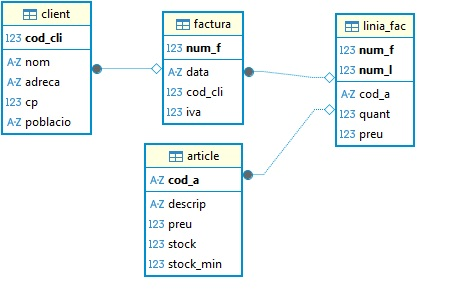
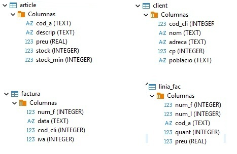
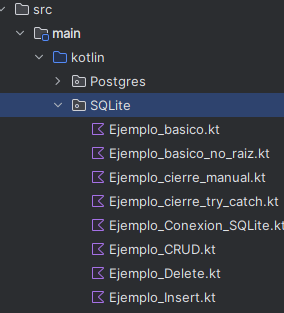
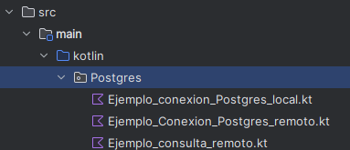

# Operaciones sobre la BD

En **JDBC** (Java Database Connectivity), las operaciones sobre la base de datos se realizan  utilizando los siguientes objetos y métodos:

- **Connection**, como ya se explicó en el apartado anterior, establece el canal de comunicación con el SGBD (PostgreSQL, MySQL, etc.)

- Los objetos **PreparedStatement** y **CreateStatement** se utlizan  para enviar consultas SQL desde tu programa hacia la base de datos, pero se usan de forma distinta y tienen ventajas diferentes.

- **ResultSet** es un objeto que contiene el resultado de una consulta SQL, y permite recorrer fila a fila el conjunto de resultados, accediendo a cada campo por nombre o por posición.

- Los métodos **executeQuery()** y **executeUpdate()** se utilizan para ejecutar sentencias SQL, pero se usan en contextos diferentes, dependiendo de si la consulta devuelve resultados o no.

**PreparedStatement VS CreateStatement**{.azul}

| Si necesitas...                                     | Usa...            |
|-----------------------------------------------------|-------------------|
| Consultas sin parámetros                            | `CreateStatement`       |
| Consultas con datos del usuario                     | `PreparedStatement` |
| Seguridad frente a inyecciones SQL                  | `PreparedStatement` |
| Ejecutar muchas veces con distintos valores         | `PreparedStatement` |
| Crear tablas o sentencias SQL complejas que no cambian | `CreateStatement`

**Peticiones a la BD**{.azul}

Cuando una aplicación se conecta a una base de datos, necesita ejecutar sentencias SQL desde el código. En JDBC (Java/Kotlin), existen dos métodos principales para ello: **executeQuery()** y **executeUpdate()**.

Ambos permiten enviar instrucciones SQL al gestor de base de datos, pero se usan en situaciones diferentes:

Método|	Uso principal|	Tipo de sentencia SQL|	Resultado que devuelve
------|--------------|-----------------------|------------------------
**executeQuery()**{.verde}|	Realizar consultas|	SELECT|	Objeto ResultSet con los datos consultados
**executeUpdate()**{.verde}|Realizar modificaciones|	INSERT, UPDATE, DELETE, DDL (CREATE, DROP, etc.)|	Un entero con el número de filas afectadas

!!!Note "execute()"
    El método **execute()** en JDBC se utiliza principalmente en los siguientes casos:

      - Cuando no se sabe de antemano qué tipo de sentencia SQL se va a ejecutar o si la consulta puede ser tanto de consulta como de modificación de datos.
      - Para ejecutar sentencias SQL que pueden devolver varios resultados.
      - En situaciones donde se necesita una gestión flexible de la ejecución, ya que execute() devuelve un booleano:
        - true si el resultado es un ResultSet (SELECT).
        - false si el resultado es un entero (INSERT, UPDATE, DELETE,CREATE, ALTER)

## 🔹CRUD - SQlite

!!!Tip "Kotlin - Instrucciones"
    Dentro del paquete `SQlite` del proyecto  `BDRelacionales`, ya creado y conectado a la BD `Tienda.sqlite`, ubicada en la carpeta de **recursos**, incluiremos los ejemplos de este apartado.
    Estos ejemplos mostrarán cómo gestionar datos desde una aplicación en Kotlin conectada a una base de datos relacional ligera, utilizando las tablas `article`, `client`, `factura` y `linia_fac`, tal y como se aprecia en el modelo relacional de la siguiente imagen.

**Tienda.sqlite**{.azul}

Modelo Relacional|Datos|Paquete SQLite
--|--|
|||

**Operaciones CRUD**{.azul}   

Las operaciones más habituales para modificar los datos en una base de datos relacional son las conocidas como **CRUD**:

- **CREATE**: Permite añadir nuevos registros a una tabla.
- **READ**: Permite consultar registros existentes.
- **UPDATE**: Permite modificar los valores de uno o varios registros existentes.
- **DELETE**: Permite eliminar registros de una tabla.

**CREATE (INSERT)**{.verde} 

**Ejemplo_Insert.kt**: Este fragmento añade un nuevo articulo "00001" a la tabla articles

    package SQLite
    import java.sql.DriverManager

    fun main() {
        val dbPath = "src/main/resources/Tienda.sqlite"
        val dbFile = java.io.File(dbPath)
        val url = "jdbc:sqlite:${dbFile.absolutePath}"

        DriverManager.getConnection(url).use { conn ->

            val sql = "INSERT INTO article (cod_a, descrip) VALUES (?, ?)"
            //conn.prepareStatement(sql)

            conn.prepareStatement(sql).use { stmt ->

                stmt.setString(1, "00001")
                stmt.setString(2, "articulo de prueba 1")
                stmt.executeUpdate()

            }

            }
        }

**UPDATE**{.verde}

**Ejemplo_Update.kt**: Este código actualiza la descripción del artículo "00001"

        package SQLite
        import java.sql.DriverManager

        fun main() {
            val dbPath = "src/main/resources/Tienda.sqlite"
            val dbFile = java.io.File(dbPath)
            val url = "jdbc:sqlite:${dbFile.absolutePath}"

            DriverManager.getConnection(url).use { conn ->

                val sql = "UPDATE article SET descrip = ? WHERE cod_a = ?"

                conn.prepareStatement(sql).use { stmt ->
                    stmt.setString(1, "descripción nueva")
                    stmt.setString(2, "00001")
                    stmt.executeUpdate()

                }
            }
        }

**DELETE**{.verde}

**Ejemplo_Delete.kt**: Este fragmento elimina el articulo "00001"

       package SQLite
       import java.sql.DriverManager

        fun main() {
            val dbPath = "src/main/resources/Tienda.sqlite"
            val dbFile = java.io.File(dbPath)
            val url = "jdbc:sqlite:${dbFile.absolutePath}"

            DriverManager.getConnection(url).use { conn ->

                val sql = "DELETE FROM article WHERE cod_a = ?"
                conn.prepareStatement(sql).use { stmt ->
                stmt.setString(1, "00001")
                stmt.executeUpdate()
                }
            }
        }

**READ (SELECT)**{.verde}

**Ejemplo_select_basico.kt**: Consulta la tabla article.

        package SQLite
        import java.io.File
        import java.sql.DriverManager

        fun main() {

            val dbPath = "src/main/resources/Tienda.sqlite"
            val dbFile = File(dbPath)
            println("Ruta de la BD: ${dbFile.absolutePath}")

            val url = "jdbc:sqlite:${dbFile.absolutePath}"

            DriverManager.getConnection(url).use { conn ->

                val sql = "SELECT cod_a, descrip, preu, stock, stock_min FROM article"

                conn.prepareStatement(sql).use { stmt ->

                    stmt.executeQuery().use { rs ->

                        println("Artículos disponibles:")
                        println("Código\tDescripción\tPrecio\tStock\tStock Mínimo")

                        while (rs.next()) {
                            val codA = rs.getString("cod_a")
                            val descrip = rs.getString("descrip")
                            val preu = rs.getDouble("preu")
                            val stock = rs.getInt("stock")
                            val stockMin = rs.getInt("stock_min")

                            println("$codA\t$descrip\t$preu\t$stock\t$stockMin")
                        }

                    }
                }
            }
        }

**Ejemplo_join.kt**: Este ejemplo obtiene las líneas de factura con nombre del artículo y ordenado por numero de factura y línea.

        package SQLite
        import java.sql.DriverManager

        fun main() {
            val dbPath = "src/main/resources/Tienda.sqlite"
            val dbFile = java.io.File(dbPath)
            val url = "jdbc:sqlite:${dbFile.absolutePath}"

            DriverManager.getConnection(url).use { conn ->

                val sql = """
                    SELECT lf.num_f, lf.num_l, lf.cod_a, a.descrip, lf.quant, lf.preu
                    FROM linia_fac lf
                    JOIN article a ON lf.cod_a = a.cod_a
                    ORDER BY lf.num_f, lf.num_l
                """.trimIndent()

                conn.prepareStatement(sql).use { stmt ->
                    stmt.executeQuery().use { rs ->
                        println("Líneas de factura:")
                        println("Factura | Línea | Artículo | Descripción | Cantidad | Precio")

                        while (rs.next()) {
                            val numF = rs.getInt("num_f")
                            val numL = rs.getInt("num_l")
                            val codA = rs.getString("cod_a")
                            val descrip = rs.getString("descrip")
                            val quant = rs.getInt("quant")
                            val preu = rs.getDouble("preu")

                            println("$numF\t$numL\t$codA\t$descrip\t$quant\t$preu")
                        }
                    }
                }
            }
        }

## 🔹Liberación de recursos

Cuando una aplicación accede a una base de datos, abre varios recursos internos que consumen memoria y conexiones activas en el sistema:

- La conexión con el servidor de base de datos (Connection)
- Las sentencias SQL preparadas (Statement o PreparedStatement)
- El resultado de la consulta (ResultSet)

Estos recursos no se liberan automáticamente cuando se termina su uso (especialmente en Java o Kotlin con JDBC). Si no se cierran correctamente, se pueden producir problemas como:

- Fugas de memoria
- Bloqueo de conexiones (demasiadas conexiones abiertas)
- Degradación del rendimiento
- Errores inesperados en la aplicación

💡 En Kotlin, puedes usar **use {}** para cerrar recursos automáticamente al finalizar el bloque, tal y como hemos hecho en los ejemplos anteriores.

Si no utilizas **use {}** en Kotlin (o try-with-resources en Java), entonces debes cerrar manualmente cada uno de los recursos abiertos (ResultSet, Statement y Connection) usando .**close()**, y normalmente deberías hacerlo dentro de un bloque **finally** para garantizar su cierre incluso si ocurre un error. El orden correcto de cierre es del más interno al más externo.

👉 Los siguientes **ejemplos** muestran como cerrar recursos abiertos sin **use()**, de forma manual y con el bloque **try-catch-finally**

**Ejemplo_cierre_manual.kt:** Cierra los recurso de forma manual con close()

        package SQLite
        import java.sql.DriverManager
        import java.sql.Connection
        import java.sql.PreparedStatement
        import java.sql.ResultSet

        fun main() {
            val dbPath = "src/main/resources/Tienda.sqlite"
            val dbFile = java.io.File(dbPath)
            val url = "jdbc:sqlite:${dbFile.absolutePath}"

            val conn: Connection = DriverManager.getConnection(url)
            val sql = "SELECT cod_a, descrip, preu, stock, stock_min FROM article"
            val stmt: PreparedStatement = conn.prepareStatement(sql)
            val rs: ResultSet = stmt.executeQuery()

            println("Artículos:")
            println("Código\tDescripción\tPrecio\tStock\tStock mín.")

            while (rs.next()) {
                val codA = rs.getString("cod_a")
                val descrip = rs.getString("descrip")
                val preu = rs.getDouble("preu")
                val stock = rs.getInt("stock")
                val stockMin = rs.getInt("stock_min")

                println("$codA\t$descrip\t$preu\t$stock\t$stockMin")
            }

            rs.close()
            stmt.close()
            conn.close()
        }

**Ejemplo_cierre_try_catch.kt:** Cierra los reursos con try-catch-finally

        package SQLite
        import java.sql.Connection
        import java.sql.DriverManager
        import java.sql.PreparedStatement
        import java.sql.ResultSet

        fun main() {
            val dbPath = "src/main/resources/Tienda.sqlite"
            val dbFile = java.io.File(dbPath)
            val url = "jdbc:sqlite:${dbFile.absolutePath}"

            var conn: Connection? = null
            var stmt: PreparedStatement? = null
            var rs: ResultSet? = null

            try {
                conn = DriverManager.getConnection(url)
                val sql = "SELECT cod_a, descrip, preu, stock, stock_min FROM article"
                stmt = conn.prepareStatement(sql)
                rs = stmt.executeQuery()

                println("Artículos:")
                println("Código\tDescripción\tPrecio\tStock\tStock mín.")

                while (rs.next()) {
                    val codA = rs.getString("cod_a")
                    val descrip = rs.getString("descrip")
                    val preu = rs.getDouble("preu")
                    val stock = rs.getInt("stock")
                    val stockMin = rs.getInt("stock_min")

                    println("$codA\t$descrip\t$preu\t$stock\t$stockMin")
                }

            } catch (e: Exception) {
                println("Error al acceder a la base de datos: ${e.message}")
            } finally {
                try { rs?.close() } catch (e: Exception) { /* Ignorar */ }
                try { stmt?.close() } catch (e: Exception) { /* Ignorar */ }
                try { conn?.close() } catch (e: Exception) { /* Ignorar */ }
            }
        }

## 🔹CRUD - PostgreSQL

Hasta ahora hemos trabajado con ejemplos de operaciones **CRUD** (Crear, Leer, Actualizar y Borrar) utilizando **SQLite**, una base de datos ligera, fácil de usar y sin necesidad de servidor, ideal para iniciarse en el acceso a datos desde Kotlin.

Sin embargo, en entornos reales y profesionales, lo más habitual es trabajar con sistemas de gestión de bases de datos más potentes y completos, como **PostgreSQL**.

A continuación, aplicaremos lo aprendido en SQLite, pero ahora trabajando con **PostgreSQL** en **dos contextos distintos**:

- Base de datos **remota**: alojada en un servidor accesible mediante una dirección IP y credenciales.
- Base de datos **local**: replicada en un contenedor **Docker**, lo que resulta ideal para pruebas, desarrollo y aprendizaje en un entorno controlado.

En ambos casos utilizaremos la misma base de datos, llamada **geo_ad**. Su versión remota estará disponible desde cualquier ubicación, mientras que la local se generará a partir de ella siguiendo unas instrucciones que se os facilitarán.

**Esquema de la BD geo_ad**{.azul} 

Modelo Relacional - Datos|Paquete Postgres
--|
|

!!!Tip "Kotlin - Instrucciones"
    Dentro del paquete `Postgres` del proyecto `BDRelacionales`, incluiremos los ejemplos de este apartado. Estos ejemplos mostrarán cómo gestionar datos desde una aplicación en Kotlin conectada a una base de datos relacional, utilizando las tablas `institut`, `poblacio` y `comarca`, tal y como se aprecia en el modelo relacional de la siguiente imagen.   

**Configuración de Dependencias (Gradle)**{.azul}

Lo primero será incluir las dependencia necesarias en **build.gradle.kts**

        // build.gradle.kts (para PostgreSQL)
        dependencies {
            implementation("org.postgresql:postgresql:42.6.0")
        }

### 🗄️Servidor remoto     

La base de datos **geo_ad** se encuentra en una máquina externa, por lo que se comporta como un recurso compartido en la nube. Para acceder a ella necesitamos establecer una conexión de red utilizando parámetros como los siguientes:

!!!Note "Datos de conexión al servido remoto"      
    **Servidor (host)**: 89.36.214.106  
    **Port**: 5432 (es el puerto por defecto)  
    **Usuari**: geo_ad  
    **Contrasenya**: geo_ad  
    **Base de dades**: geo_ad  

**Ejemplo_conexion_Postgres_remota.kt**

        package Postgres
        import java.sql.DriverManager
        object DatabaseRemota {

            private const val URL =  "jdbc:postgresql://89.36.214.106:5432/geo_ad"
            private const val USER = "geo_ad"
            private const val PASSWORD = "geo_ad"

            fun getConnection() = DriverManager.getConnection(URL, USER, PASSWORD)
        }

**Operaciones CRUD**{.azul}     

Una vez conectados a la BD, ya podemos hacer operaciones CRUD sobre ella, utilizando el objeto de conexión correspondiente.

**Read (SELECT)**{.verde}     

**Ejemplo_Select.kt**: Consulta todos los institutos

            package Postgres
            fun main(args: Array<String>) {
            val sql = "SELECT * FROM institut"

            DatabaseLocal.getConnection().use { conn ->    // DatabaseRemota si se conecta al servidor del instituto
                    conn.prepareStatement(sql).use { stmt ->
                    stmt.executeQuery().use { rs ->

                        while (rs.next()) {
                            print("" + rs.getString(1) + "\t")
                            println(rs.getString(2))
                        }
                    }
                }
                }
             }

---

**Create (INSERT)**{.verde}  

**Ejemplo_Insert.kt**: inserta un istituto de prueba.

        package Postgres
        fun main(args: Array<String>) {

            val sql ="INSERT INTO institut (codi,nom,adreca,numero,codpostal,cod_m) VALUES(?,?,?,?,?,?)"

            DatabaseLocal.getConnection().use { conn ->

                conn.prepareStatement(sql).use { stmt ->
                    stmt.setString(1, "00000000")
                    stmt.setString(2, "IES PRUEBA")
                    stmt.setString(3, "CASTELLÓN")
                    stmt.setString(4, "S/N")
                    stmt.setInt(5, 12560)
                    stmt.setInt(6, 12040)
                    stmt.executeUpdate()
                }
            }
        }

**Update (UPDATE)**{.verde}    

**Ejemplo_Update.kt**: actualiza el campo nombre del instituto de prueba insertado.

        package Postgres
        fun main() {
            val sql = "UPDATE institut SET nom = ? WHERE codi = ?"

            DatabaseLocal.getConnection().use { conn ->

                conn.prepareStatement(sql).use { stmt ->
                    stmt.setString(1, "IES PRUEBA 2")
                    stmt.setString(2, "00000000")
                    stmt.executeUpdate()
                }
            }
        }

**Delete (DELETE)**{.verde}   
 

**Ejemplo_Delete.kt**: elimina el instituto de prueba insertado anteriormente.
        
        package Postgres
        fun main() {
            val sql = "DELETE FROM institut WHERE codi = ?"

            DatabaseLocal.getConnection().use { conn ->

                conn.prepareStatement(sql).use { stmt ->
                    stmt.setString(1, "00000000")
                    stmt.executeUpdate()
                }
            }
        }

### 🐳 Docker

Para poder programar y probar nuestras aplicaciones sin depender de la conexión externa, es muy útil replicar esa base de datos en local. La forma más sencilla y estandarizada de hacerlo es mediante **Docker**.

- Docker es una plataforma que permite ejecutar aplicaciones dentro de contenedores.
- Un contenedor es como una “caja” que incluye todo lo necesario para que un servicio funcione: sistema operativo reducido, librerías, configuración y la propia aplicación.
- Para bases de datos, existen imágenes oficiales (Postgres, MySQL, MongoDB…) que se pueden levantar en segundos.

!!!Note "Intrucciones para replicar la BD en local (Docker)"   
    Las instrucciones para replicar la base de datos en Docker las podéis encontrar en el siguiente enlace:[Instrucciones](Docker_instrucciones.md)    

---  

Una vez hemos creada la BD en local ya podemos conectarnos a ella:    

**Ejemplo_conexion_Postgres_local.kt**
        
        package Postgres
        import java.sql.DriverManager
        object DatabaseLocal {

            private const val URL =  "jdbc:postgresql://localhost:5432/geo"
            private const val USER = "postgres"
            private const val PASSWORD = "postgres"

            fun getConnection() = DriverManager.getConnection(URL, USER, PASSWORD)
        }

!!!Note "Nota"
    Los ejemplos anteriores de operaciones CRUD, realizados sobre el servidor remoto, son igualmente válidos para el servidor local, ya que la base de datos es la misma.

#### Instrucciones

[Instrucciones](Docker_instrucciones.md)

## 🔹Data Class

Hasta ahora hemos trabajado con bases de datos relacionales utilizando JDBC, construyendo consultas SQL, procesando los resultados con ResultSet y mostrando la información directamente por consola o almacenándola en estructuras básicas como listas o mapas.

Sin embargo, cuando una aplicación crece, se vuelve más cómodo y legible representar cada tabla de la base de datos como una clase del programa, cuyos atributos correspondan a las columnas de esa tabla.
En **Kotlin**, esto se consigue de forma sencilla y elegante utilizando las **data classes**.

Una **data class** (o clase de datos) es una clase especial de Kotlin diseñada para almacenar y transportar información.
El compilador genera automáticamente métodos útiles como toString(), equals(), hashCode() y copy(), por lo que resulta ideal para representar filas (registros) de una tabla de base de datos.

Su sintáxis básica es:

        data class NombreClase(val campo1: Tipo, val campo2: Tipo, ...)

🧩 **Ejemplo**: representación de una tabla cliente

Supongamos que en la base de datos existe una tabla:

        CREATE TABLE cliente (
            id INTEGER PRIMARY KEY,
            nombre TEXT,
            email TEXT
        );

Podemos definir la siguiente clase en Kotlin:

        data class Cliente(
            val id: Int,
            val nombre: String,
            val email: String
        )

Y al realizar una consulta con JDBC:

        val clientes = mutableListOf<Cliente>()
        val rs = stmt.executeQuery("SELECT * FROM cliente")

        while (rs.next()) {
            clientes.add(
                Cliente(
                    id = rs.getInt("id"),
                    nombre = rs.getString("nombre"),
                    email = rs.getString("email")
                )
            )
        }

En este ejemplo:

- Cada fila del ResultSet se convierte en un objeto Cliente.
- Todos los clientes recuperados se almacenan en una lista tipada (List<Cliente>).
- Posteriormente se pueden mostrar, modificar o procesar con facilidad.

### 📌 **Uso de `data class` en la BD Geo**

En este ejemplo replicamos la misma consulta que ya vimos anteriormente para obtener todos los institutos de la base de datos **geo_ad** alojada en el servidor remoto, pero ahora utilizando un **`data class`** en Kotlin. 

Esto nos permite representar cada fila del resultado como un objeto de tipo `Institut`, facilitando el tratamiento, la reutilización y la lectura del código.

Además, almacenamos los resultados en una lista de objetos, lo que nos permite trabajar con ellos de forma más natural dentro de nuestro programa (listar, filtrar, transformar, etc.).

**Data Class: Institut**

    package Postgres

        data class Institut(
            val codi: String,
            val nom: String?,
            val adreca: String?,
            val numero: String?,
            val codpostal: Int?,
            val codMunicipi: Int?
        )

**Ejemplo_dataclass.kt**

    package Postgres

        fun main() {
            val sql = "SELECT * FROM institut"

            val instituts = mutableListOf<Institut>()

            DatabaseRemota.getConnection().use { conn ->  // Usa DatabaseRemota si es necesario
                conn.prepareStatement(sql).use { stmt ->
                    stmt.executeQuery().use { rs ->
                        while (rs.next()) {
                            val institut = Institut(
                                rs.getString("codi"),
                                rs.getString("nom"),
                                rs.getString("adreca"),
                                rs.getString("numero"),
                                rs.getInt("codpostal"),
                                rs.getInt("cod_m")
                            )
                            instituts.add(institut)
                        }
                    }
                }
            }

            println("🏫 Institutos encontrados:")
            instituts.forEach { println(it) }
        }