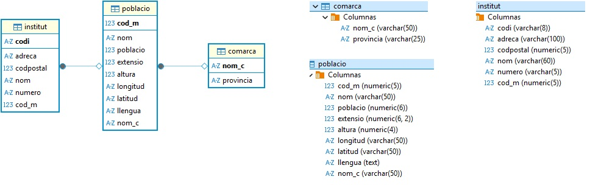

# Operaciones sobre la BD

En **JDBC** (Java Database Connectivity), las operaciones sobre la base de datos se realizan  utilizando los siguientes objetos y métodos:

- **Connection**, como ya se explicó en el apartado anterior, establece el canal de comunicación con el SGBD (PostgreSQL, MySQL, etc.)

- Los objetos **PreparedStatement** y **CreateStatement** se utlizan  para enviar consultas SQL desde tu programa hacia la base de datos, pero se usan de forma distinta y tienen ventajas diferentes.

- **ResultSet** es un objeto que contiene el resultado de una consulta SQL, y permite recorrer fila a fila el conjunto de resultados, accediendo a cada campo por nombre o por posición.

- Los métodos **executeQuery()** y **executeUpdate()** se utilizan para ejecutar sentencias SQL, pero se usan en contextos diferentes, dependiendo de si la consulta devuelve resultados o no.

**PreparedStatement VS CreateStatement**{.azul}

| Si necesitas...                                     | Usa...            |
|-----------------------------------------------------|-------------------|
| Consultas sin parámetros                            | `CreateStatement`       |
| Consultas con datos del usuario                     | `PreparedStatement` |
| Seguridad frente a inyecciones SQL                  | `PreparedStatement` |
| Ejecutar muchas veces con distintos valores         | `PreparedStatement` |
| Crear tablas o sentencias SQL complejas que no cambian | `CreateStatement`

**Peticiones a la BD**{.azul}

Cuando una aplicación se conecta a una base de datos, necesita ejecutar sentencias SQL desde el código. En JDBC (Java/Kotlin), existen dos métodos principales para ello: **executeQuery()** y **executeUpdate()**.

Ambos permiten enviar instrucciones SQL al gestor de base de datos, pero se usan en situaciones diferentes:

Método|	Uso principal|	Tipo de sentencia SQL|	Resultado que devuelve
------|--------------|-----------------------|------------------------
**executeQuery()**{.verde}|	Realizar consultas|	SELECT|	Objeto ResultSet con los datos consultados
**executeUpdate()**{.verde}|Realizar modificaciones|	INSERT, UPDATE, DELETE, DDL (CREATE, DROP, etc.)|	Un entero con el número de filas afectadas

!!!Note "execute()"
    El método **execute()** en JDBC se utiliza principalmente en los siguientes casos:

      - Cuando no se sabe de antemano qué tipo de sentencia SQL se va a ejecutar o si la consulta puede ser tanto de consulta como de modificación de datos.
      - Para ejecutar sentencias SQL que pueden devolver varios resultados.
      - En situaciones donde se necesita una gestión flexible de la ejecución, ya que execute() devuelve un booleano:
        - true si el resultado es un ResultSet (SELECT).
        - false si el resultado es un entero (INSERT, UPDATE, DELETE,CREATE, ALTER)

## 🔹CRUD - SQlite

!!!Tip "Kotlin - Instrucciones"
    Dentro del paquete `SQlite` del proyecto  `BDRelacionales`, ya creado y conectado a la BD `Tienda.sqlite`, ubicada en la carpeta de **recursos**, incluiremos los ejemplos de este apartado.
    Estos ejemplos mostrarán cómo gestionar datos desde una aplicación en Kotlin conectada a una base de datos relacional ligera, utilizando las tablas `article`, `client`, `factura` y `linia_fac`, tal y como se aprecia en el modelo relacional de la siguiente imagen.

**Tienda.sqlite**{.azul}

Modelo Relacional|Datos|Paquete SQLite
--|--|
|||

**Operaciones CRUD**{.azul}   

Las operaciones más habituales para modificar los datos en una base de datos relacional son las conocidas como **CRUD**:

- **CREATE**: Permite añadir nuevos registros a una tabla.
- **READ**: Permite consultar registros existentes.
- **UPDATE**: Permite modificar los valores de uno o varios registros existentes.
- **DELETE**: Permite eliminar registros de una tabla.

**INSERT**{.verde} 

**Ejemplo_Insert.kt**: Este fragmento añade un nuevo articulo "00001" a la tabla articles

    package SQLite
    import java.sql.DriverManager

    fun main() {
        val dbPath = "src/main/resources/Tienda.sqlite"
        val dbFile = java.io.File(dbPath)
        val url = "jdbc:sqlite:${dbFile.absolutePath}"

        DriverManager.getConnection(url).use { conn ->

            val sql = "INSERT INTO article (cod_a, descrip) VALUES (?, ?)"
            //conn.prepareStatement(sql)

            conn.prepareStatement(sql).use { stmt ->

                stmt.setString(1, "00004")
                stmt.setString(2, "articulo de prueba 1")
                stmt.executeUpdate()

            }

            }
        }

**UPDATE**{.verde}

**Ejemplo_Update.kt**: Este código actualiza la descripción del artículo "00001"

        package SQLite
        import java.sql.DriverManager

        fun main() {
            val dbPath = "src/main/resources/Tienda.sqlite"
            val dbFile = java.io.File(dbPath)
            val url = "jdbc:sqlite:${dbFile.absolutePath}"

            DriverManager.getConnection(url).use { conn ->

                val sql = "UPDATE article SET descrip = ? WHERE cod_a = ?"

                conn.prepareStatement(sql).use { stmt ->
                    stmt.setString(1, "descripción nueva")
                    stmt.setString(2, "00001")
                    stmt.executeUpdate()

                }
            }
        }

**DELETE**{.verde}

**Ejemplo_Delete.kt**: Este fragmento elimina el articulo "00001"

       package SQLite
       import java.sql.DriverManager

        fun main() {
            val dbPath = "src/main/resources/Tienda.sqlite"
            val dbFile = java.io.File(dbPath)
            val url = "jdbc:sqlite:${dbFile.absolutePath}"

            DriverManager.getConnection(url).use { conn ->

                val sql = "DELETE FROM article WHERE cod_a = ?"
                conn.prepareStatement(sql).use { stmt ->
                stmt.setString(1, "00001")
                stmt.executeUpdate()
                }
            }
        }

**INSERT (SELECT)**{.verde}

**Ejemplo_select_basico.kt**: Consulta la tabla article.

        package SQLite
        import java.io.File
        import java.sql.DriverManager

        fun main() {

            val dbPath = "src/main/resources/Tienda.sqlite"
            val dbFile = File(dbPath)
            println("Ruta de la BD: ${dbFile.absolutePath}")

            val url = "jdbc:sqlite:${dbFile.absolutePath}"

            DriverManager.getConnection(url).use { conn ->

                val sql = "SELECT cod_a, descrip, preu, stock, stock_min FROM article"

                conn.prepareStatement(sql).use { stmt ->

                    stmt.executeQuery().use { rs ->

                        println("Artículos disponibles:")
                        println("Código\tDescripción\tPrecio\tStock\tStock Mínimo")

                        while (rs.next()) {
                            val codA = rs.getString("cod_a")
                            val descrip = rs.getString("descrip")
                            val preu = rs.getDouble("preu")
                            val stock = rs.getInt("stock")
                            val stockMin = rs.getInt("stock_min")

                            println("$codA\t$descrip\t$preu\t$stock\t$stockMin")
                        }

                    }
                }
            }
        }

**Ejemplo_join.kt**: Este ejemplo obtiene las líneas de factura con nombre del artículo y ordenado por numero de factura y línea.

        package SQLite
        import java.sql.DriverManager

        fun main() {
            val dbPath = "src/main/resources/Tienda.sqlite"
            val dbFile = java.io.File(dbPath)
            val url = "jdbc:sqlite:${dbFile.absolutePath}"

            DriverManager.getConnection(url).use { conn ->

                val sql = """
                    SELECT lf.num_f, lf.num_l, lf.cod_a, a.descrip, lf.quant, lf.preu
                    FROM linia_fac lf
                    JOIN article a ON lf.cod_a = a.cod_a
                    ORDER BY lf.num_f, lf.num_l
                """.trimIndent()

                conn.prepareStatement(sql).use { stmt ->
                    stmt.executeQuery().use { rs ->
                        println("Líneas de factura:")
                        println("Factura | Línea | Artículo | Descripción | Cantidad | Precio")

                        while (rs.next()) {
                            val numF = rs.getInt("num_f")
                            val numL = rs.getInt("num_l")
                            val codA = rs.getString("cod_a")
                            val descrip = rs.getString("descrip")
                            val quant = rs.getInt("quant")
                            val preu = rs.getDouble("preu")

                            println("$numF\t$numL\t$codA\t$descrip\t$quant\t$preu")
                        }
                    }
                }
            }
        }

## 🔹Liberación de recursos

Cuando una aplicación accede a una base de datos, abre varios recursos internos que consumen memoria y conexiones activas en el sistema:

- La conexión con el servidor de base de datos (Connection)
- Las sentencias SQL preparadas (Statement o PreparedStatement)
- El resultado de la consulta (ResultSet)

Estos recursos no se liberan automáticamente cuando se termina su uso (especialmente en Java o Kotlin con JDBC). Si no se cierran correctamente, se pueden producir problemas como:

- Fugas de memoria
- Bloqueo de conexiones (demasiadas conexiones abiertas)
- Degradación del rendimiento
- Errores inesperados en la aplicación

En Kotlin, puedes usar **use {}** para cerrar recursos automáticamente al finalizar el bloque.

Si no utilizas **use {}** en Kotlin (o try-with-resources en Java), entonces debes cerrar manualmente cada uno de los recursos abiertos (ResultSet, Statement y Connection) usando .**close()**, y normalmente deberías hacerlo dentro de un bloque **finally** para garantizar su cierre incluso si ocurre un error. El orden correcto de cierre es del más interno al más externo.

**Ejemplos**{.azul} para cerrar recursos abiertos sin **use()**, de forma manual y con el bloque **try-catch-finally**

**Ejemplo_cierre_manual.kt:** Cierra los recurso con close()

        package SQLite
        import java.sql.DriverManager
        import java.sql.Connection
        import java.sql.PreparedStatement
        import java.sql.ResultSet

        fun main() {
            val dbPath = "src/main/resources/Tienda.sqlite"
            val dbFile = java.io.File(dbPath)
            val url = "jdbc:sqlite:${dbFile.absolutePath}"

            val conn: Connection = DriverManager.getConnection(url)
            val sql = "SELECT cod_a, descrip, preu, stock, stock_min FROM article"
            val stmt: PreparedStatement = conn.prepareStatement(sql)
            val rs: ResultSet = stmt.executeQuery()

            println("Artículos:")
            println("Código\tDescripción\tPrecio\tStock\tStock mín.")

            while (rs.next()) {
                val codA = rs.getString("cod_a")
                val descrip = rs.getString("descrip")
                val preu = rs.getDouble("preu")
                val stock = rs.getInt("stock")
                val stockMin = rs.getInt("stock_min")

                println("$codA\t$descrip\t$preu\t$stock\t$stockMin")
            }

            rs.close()
            stmt.close()
            conn.close()
        }

**Ejemplo_cierre_try_catch.kt:** Cierra los reursos con try-catch-finally

        package SQLite
        import java.sql.Connection
        import java.sql.DriverManager
        import java.sql.PreparedStatement
        import java.sql.ResultSet

        fun main() {
            val dbPath = "src/main/resources/Tienda.sqlite"
            val dbFile = java.io.File(dbPath)
            val url = "jdbc:sqlite:${dbFile.absolutePath}"

            var conn: Connection? = null
            var stmt: PreparedStatement? = null
            var rs: ResultSet? = null

            try {
                conn = DriverManager.getConnection(url)
                val sql = "SELECT cod_a, descrip, preu, stock, stock_min FROM article"
                stmt = conn.prepareStatement(sql)
                rs = stmt.executeQuery()

                println("Artículos:")
                println("Código\tDescripción\tPrecio\tStock\tStock mín.")

                while (rs.next()) {
                    val codA = rs.getString("cod_a")
                    val descrip = rs.getString("descrip")
                    val preu = rs.getDouble("preu")
                    val stock = rs.getInt("stock")
                    val stockMin = rs.getInt("stock_min")

                    println("$codA\t$descrip\t$preu\t$stock\t$stockMin")
                }

            } catch (e: Exception) {
                println("Error al acceder a la base de datos: ${e.message}")
            } finally {
                try { rs?.close() } catch (e: Exception) { /* Ignorar */ }
                try { stmt?.close() } catch (e: Exception) { /* Ignorar */ }
                try { conn?.close() } catch (e: Exception) { /* Ignorar */ }
            }
        }

## 🔹CRUD - PostgreSQL

!!!Tip "Kotlin - Instrucciones"
    En el proyecto `BDRelacionales` crearemos un **paquete** llamado `Postgres`, donde incluiremos los ejemplos de este apartado.   
   
    

Hasta ahora hemos trabajado con ejemplos de operaciones **CRUD** (Crear, Leer, Actualizar y Borrar) utilizando **SQLite**, una base de datos ligera, fácil de usar y sin necesidad de servidor, ideal para iniciarse en el acceso a datos desde Kotlin.

Sin embargo, en entornos reales y profesionales, lo más habitual es trabajar con sistemas de gestión de bases de datos más potentes y completos, como **PostgreSQL**.

A continuación, aplicaremos lo aprendido en SQLite, pero ahora trabajando con **PostgreSQL** en **dos contextos distintos**:

- Base de datos **remota**: alojada en un servidor accesible mediante una dirección IP y credenciales.
- Base de datos **local**: replicada en un contenedor **Docker**, lo que resulta ideal para pruebas, desarrollo y aprendizaje en un entorno controlado.

En ambos casos utilizaremos la misma base de datos, llamada geo_ad. Su versión remota estará disponible desde cualquier ubicación, mientras que la local se generará a partir de ella siguiendo unas instrucciones que se os facilitarán. El esquema relacional de `geo_ad` es el siguiente:

**Esquema de la BD geo_ad**{.azul} 

!!!Note "Datos de conexión al servido remoto"      
    **Servidor (host)**: 89.36.214.106  
    **Port**: 5432 (és el port per defecte)  
    **Usuari**: geo_ad  
    **Contrasenya**: geo_ad  
    **Base de dades**: geo_ad  

!!!Note "Intrucciones para replicar la BD en local (Docker)"   
    Las instrucciones para replicar la base de datos en Docker las podéis encontrar en el siguiente enlace: [Instrucciones](https://docs.google.com/document/d/1uU5B9MonTf1KhIOP5PkECIfP-NCSkdzDAo2W33P81Js/edit?tab=t.0)

**Configuración de Dependencias (Gradle)**{.azul}

Lo primero será incluir las dependencia necesarias en **build.gradle.kts**

        // build.gradle.kts (para PostgreSQL)
        dependencies {
            implementation("org.postgresql:postgresql:42.6.0")
        }

**Conexión al servidor**{.azul}

**Postgres remoto**{.verde}

**Ejemplo_conexion_Postgres_remota.kt**

        package Postgres
        import java.sql.DriverManager
        object DatabaseRemota {

            private const val URL =  "jdbc:postgresql://89.36.214.106:5432/geo_ad"
            private const val USER = "geo_ad"
            private const val PASSWORD = "geo_ad"

            fun getConnection() = DriverManager.getConnection(URL, USER, PASSWORD)
        }

**Postgress en Docker**{.verde}

**Ejemplo_conexion_Postgres_local.kt**
        
        package Postgres
        import java.sql.DriverManager
        object DatabaseLocal {

            private const val URL =  "jdbc:postgresql://localhost:5432/geo"
            private const val USER = "postgres"
            private const val PASSWORD = "postgres"

            fun getConnection() = DriverManager.getConnection(URL, USER, PASSWORD)
        }

**Operaciones CRUD**{.azul}     

Los ejemplos siguientes son igualmente válidos tanto si nos conectamos al servidor remoto como al local, ya que son iguales.  
Una vez conectados a la BD, ya podemos hacer operaciones CRUD sobre ella, utilizando el objeto de conexión correspondiente.

**Read (SELECT)**{.verde}     

**Ejemplo_Select.kt**: Consulta todos los institutos

            package Postgres
            fun main(args: Array<String>) {
            val sql = "SELECT * FROM institut"

            DatabaseLocal.getConnection().use { conn ->    // DatabaseRemota si se conecta al servidor del instituto
                    conn.prepareStatement(sql).use { stmt ->
                    stmt.executeQuery().use { rs ->

                        while (rs.next()) {
                            print("" + rs.getString(1) + "\t")
                            println(rs.getString(2))
                        }
                    }
                }
                }
             }

---

**Create (INSERT)**{.verde}  

**Ejemplo_Insert.kt**: inserta un istituto de prueba.

        package Postgres
        fun main(args: Array<String>) {

            val sql ="INSERT INTO institut (codi,nom,adreca,numero,codpostal,cod_m) VALUES(?,?,?,?,?,?)"

            DatabaseLocal.getConnection().use { conn ->

                conn.prepareStatement(sql).use { stmt ->
                    stmt.setString(1, "00000000")
                    stmt.setString(2, "IES PRUEBA")
                    stmt.setString(3, "CASTELLÓN")
                    stmt.setString(4, "S/N")
                    stmt.setInt(5, 12560)
                    stmt.setInt(6, 12040)
                    stmt.executeUpdate()
                }
            }
        }

**Update (UPDATE)**{.verde}    

**Ejemplo_Update.kt**: actualiza el campo nombre del instituto de prueba insertado.

        package Postgres
        fun main() {
            val sql = "UPDATE institut SET nom = ? WHERE codi = ?"

            DatabaseLocal.getConnection().use { conn ->

                conn.prepareStatement(sql).use { stmt ->
                    stmt.setString(1, "IES PRUEBA 2")
                    stmt.setString(2, "00000000")
                    stmt.executeUpdate()
                }
            }
        }

**Delete (DELETE)**{.verde}   
 

**Ejemplo_Delete.kt**: elimina el instituto de prueba insertado anteriormente.
        
        package Postgres
        fun main() {
            val sql = "DELETE FROM institut WHERE codi = ?"

            DatabaseLocal.getConnection().use { conn ->

                conn.prepareStatement(sql).use { stmt ->
                    stmt.setString(1, "00000000")
                    stmt.executeUpdate()
                }
            }
        }

